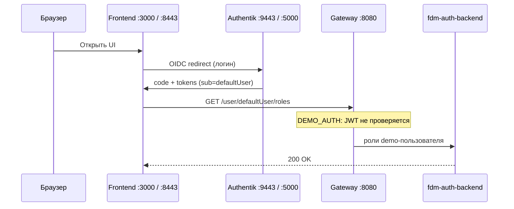

# BeeAtlas FDM Infrastructure (Docker Compose)

Репозиторий для поднятия **BeeAtlas FDM** одной командой Docker Compose.

## Оглавление

1. [Общее описание](#1-общее-описание)
2. [Шпаргалка: локальные URL и доступы](#2-шпаргалка-локальные-url-и-доступы)
3. [Два режима запуска](#3-два-режима-запуска)
4. [Архитектура и сервисы](#4-архитектура-и-сервисы)
5. [Требования](#5-требования)
6. [Быстрый старт](#6-быстрый-старт)
7. [Submodules и локальная разработка](#7-submodules-и-локальная-разработка)
8. [Authentik — вход в приложение](#8-authentik--вход-в-приложение)
9. [Конфигурация](#9-конфигурация)
10. [Управление средой](#10-управление-средой)
11. [Порты всех сервисов](#11-порты-всех-сервисов)
12. [Postman](#12-postman)
13. [Известные ограничения](#13-известные-ограничения)
14. [Лицензия](#14-лицензия)

---

## 1. Общее описание

Все сервисы работают в сети `fdm-network` и используют общую инфраструктуру.

| Компонент | Назначение |
|-----------|------------|
| **PostgreSQL** (`fdm-postgres`) | Единая БД `fdm_db`, отдельные **схемы** на сервис (`init-schemas.sql`) |
| **RabbitMQ** (`fdm-rabbitmq`) | Очереди и exchange; конфиг в `rabbitmq/definitions.json` |
| **Redis** | Кэш для `architect-graph-service`; брокер для Authentik |
| **Neo4j** | Граф архитектуры для `architect-graph-service` |
| **Qdrant** | Векторное хранилище для `fdm-search` |
| **MinIO** | S3-хранилище для `document-service` |
| **Authentik** | OIDC-логин для frontend |
| **Gateway** | Единая точка входа API |
| **Frontend** | UI BeeAtlas |

Общие переменные окружения — в **`common.env`**.

---

## 2. Шпаргалка: локальные URL и доступы

### UI и вход

| Что | URL | Логин / пароль |
|-----|-----|----------------|
| **Frontend (HTTP)** | http://localhost:3000 | через Authentik |
| **Frontend (HTTPS через ingress)** | https://localhost:8443 | через Authentik |
| **Authentik OIDC (HTTPS)** | https://localhost:9443 | — |
| **Authentik админка (HTTP)** | http://localhost:5000 | `akadmin` / `password` |
| **Документация** | http://localhost:8097 | — |

После открытия фронта браузер редиректит на Authentik. Вход: **`akadmin` / `password`**.  
В токене пользователь API — `defaultUser` (demo).

> Рекомендуемый URL UI: **https://localhost:8443** (как в blueprint redirect URI).  
> Также работает **http://localhost:3000** (redirect URI на `:3000` тоже разрешён).

### API

| Что | URL |
|-----|-----|
| **Gateway (основной API)** | http://localhost:8080 |
| Health gateway | http://localhost:8080/actuator/health |
| OIDC discovery | http://localhost:5000/application/o/beeatlas/.well-known/openid-configuration |

### Инфраструктура: БД, очереди, S3, граф

| Что | URL / адрес | Логин / пароль | Примечание |
|-----|-------------|----------------|------------|
| **PostgreSQL (FDM)** | `localhost:5433` | `postgres` / `postgres` | БД `fdm_db` |
| **PostgreSQL (Authentik)** | `localhost:5434` | `authentik` / `authentik` | БД `authentik_db` |
| **RabbitMQ AMQP** | `localhost:5672` | `guest` / `guest` | |
| **RabbitMQ Management UI** | http://localhost:15672 | `guest` / `guest` | Очереди, exchange |
| **Redis** | внутри сети `redis:6379` | пароль `redis-password` | На хост не проброшен |
| **Neo4j Browser** | http://localhost:7474 | `neo4j` / `password` | |
| **Neo4j Bolt** | `bolt://localhost:7687` | `neo4j` / `password` | |
| **MinIO Console (S3 UI)** | http://localhost:9001 | `minioadmin` / `minioadmin` | Смотреть бакеты |
| **MinIO S3 API** | http://localhost:9000 | `minioadmin` / `minioadmin` | Бакет `document-service-documents` |
| **Qdrant** | http://localhost:6333 | API key `qdrant` | Для search |
| **MCP Gateway (Unla)** | http://localhost:18080 | — | |

### Полезные UI рядом

| Что | URL | Логин / пароль |
|-----|-----|----------------|
| Structurizr On-Premises | http://localhost:8087 | — |
| Structurizr backend OpenAPI | http://localhost:8086/docs | — |
| Web IDE | http://localhost:8088 | пароль `my_secure_password` |

Полная таблица портов микросервисов — [раздел 11](#11-порты-всех-сервисов).

---

## 3. Два режима запуска

| Файл | Когда использовать |
|------|-------------------|
| **`docker-compose-run.yml`** | **Рекомендуется** — готовые образы из GHCR (`ghcr.io/tech-beeline/...:latest`) |
| **`docker-compose.yml`** | Локальная **сборка** из submodules (`services/*/Dockerfile`) |

```bash
# Рекомендуемый способ — готовые образы
docker compose -f docker-compose-run.yml pull
docker compose -f docker-compose-run.yml up -d

# Локальная сборка (разработка кода в submodule)
docker compose up -d --build
```

Обновление образов:

```bash
docker compose -f docker-compose-run.yml pull
docker compose -f docker-compose-run.yml up -d --force-recreate
```

> **Podman:** те же команды с `podman compose` вместо `docker compose`.

> Изменения в submodule (миграции Flyway и т.п.) попадут в `docker-compose-run.yml` только после **сборки и push образа** в GHCR.

---

## 4. Архитектура и сервисы

### Инфраструктура

- `postgres` (`fdm-postgres`), `rabbitmq`, `redis`, `neo4j`, `qdrant`
- `authentik-postgres`, `authentik-server`, `authentik-worker`
- `document-service-minio`, `document-service-minio-init`
- `ingress` — HTTPS: frontend `:8443`, Authentik `:9443`
- `on-premises` — Structurizr On-Premises
- `mcp-gateway`, `mcp-gateway-init` — MCP gateway (Unla)
- `fdm-bpm-local-init` — одноразовая инициализация BPM URL в Postgres

### Java / Spring Boot

| Сервис | Схема Postgres | Назначение |
|--------|----------------|------------|
| `gateway` | — | API Gateway, маршрутизация, demo-auth |
| `fdm-auth-backend` | `user_auth` | Аутентификация и роли |
| `capability-backend` | `capability` | Business / Tech Capability |
| `products-service` | `product` | Продукты, контейнеры, операции |
| `techradar-backend` | `techradar` | Техрадар |
| `architect-graph-service` | — (Neo4j) | Архитектурный граф |
| `cx-service` | `cx` | Customer Journey |
| `notifications-service` | `notification` | Уведомления |
| `document-service` | `documents` | Документы (S3/MinIO) |
| `fdm-pack-loader` | `pack_loader` | Загрузка пакетов |
| `events-history` | `entity_events` | История событий |
| `fdm-bpm` | `processes` (+ Camunda) | BPM / процессы |
| `staging-service` | `staging` / `staging_camunda` | Staging |
| `fdm-search` | — (Qdrant) | Поиск |

### Python / Node / прочее

| Сервис | Назначение |
|--------|------------|
| `structurizr-backend` | API диаграмм (FastAPI) |
| `ff-manager` | Feature flags (схема `ff`) |
| `obs-dashboard` | Генерация Grafana E2E-дашбордов по CJ |
| `beeatlas-frontend` | Frontend |
| `beeatlas-doc` | Документация |
| `web-ide` | VS Code Server + C4 |

Схемы Postgres при **первом** старте (`init-schemas.sql`):  
`product`, `capability`, `user_auth`, `techradar`, `pack_loader`, `entity_events`, `processes`, `cx`, `notification`, `documents`, `ff`, `staging`, `staging_camunda`.

---

## 5. Требования

| Компонент | Версия |
|-----------|--------|
| Docker Engine / Podman | 20.10+ / 4.0+ |
| Docker Compose (v2) | 2.0+ |
| Git | для submodules |

Свободные порты (по умолчанию): **3000**, **5000**, **5433**, **5434**, **5672**, **6333–6334**, **7474**, **7687**, **8080–8100**, **8443**, **9000–9001**, **9443**, **15672**, **18080**.

---

## 6. Быстрый старт

### 6.1 Клонирование

```bash
git clone --recurse-submodules https://github.com/tech-beeline/beeatlas-fdm-infrastructure.git
cd beeatlas-fdm-infrastructure
```

Если submodules не подтянулись:

```bash
git submodule update --init --recursive
```

### 6.2 Запуск

```bash
# рекомендуется
docker compose -f docker-compose-run.yml pull
docker compose -f docker-compose-run.yml up -d

# или локальная сборка
docker compose up -d --build
```

Дождитесь `healthy` у ключевых сервисов: `postgres`, `authentik-server`, `fdm-auth-backend`, `gateway`, `beeatlas-frontend`.

### 6.3 Проверка статуса

```bash
docker compose -f docker-compose-run.yml ps -a
```

В рабочем состоянии сервисы стенда должны быть в статусе **`Up`** / **`healthy`**.  
Контейнеры `*-init` после успешного выполнения завершаются со статусом **`Exited (0)`** — это штатное поведение.

### 6.4 Быстрая проверка URL

```bash
curl -s http://localhost:8080/actuator/health
curl -s -o /dev/null -w "%{http_code}\n" http://localhost:3000/
curl -s -o /dev/null -w "%{http_code}\n" http://localhost:5000/application/o/beeatlas/.well-known/openid-configuration
```

Ожидается `200` на OIDC discovery. Дальше — [вход через Authentik](#8-authentik--вход-в-приложение).

---

## 7. Submodules и локальная разработка

Исходники микросервисов — git submodules в `services/` (см. `.gitmodules`).

| Путь | Репозиторий |
|------|-------------|
| `services/gateway` | beeatlas-fdm-gateway-service |
| `services/fdm-auth-service` | beeatlas-fdm-auth-service |
| `services/products-service` | beeatlas-fdm-products-service |
| `services/capability-service` | beeatlas-capability-backend-service |
| `services/techradar-service` | beeatlas-fdm-techradar-service |
| `services/architect-graph-service` | beeatlas-architect-graph-service |
| `services/structurizr_backend` | beeatlas-structurizr-backend |
| `services/notifications-service` | beeatlas-notifications-management |
| `services/document-service` | beeatlas-document-service |
| `services/cx-service` | beeatlas-fdm-cx-service |
| `services/events-history` | beeatlas-events-history |
| `services/fdm-pack-loader` | beeatlas-fdm-pack-loader |
| `services/fdm-bpm` | beeatlas-fdm-bpm |
| `services/ff-manager` | beeatlas-ff-manager |
| `services/obs-dashboard` | beeatlas-obs-dashboard |
| `services/prospect-frontend` | beeatlas-prospect-frontend |
| `services/beeatlas-doc` | beeatlas-doc |
| `services/staging-service` | beeatlas-staging-service |
| `services/fdm-search` | beeatlas-fdm-search |

Typical workflow:

```bash
cd services/techradar-service && git pull origin main && cd ../..
docker compose build techradar-backend
docker compose up -d techradar-backend
```

Для `docker-compose-run.yml` после изменений нужен новый образ в GHCR и `pull`.

---

## 8. Authentik — вход в приложение

Authentik на локальном стенде нужен **для UI** (логин / logout / сессия).  
API через gateway в demo-режиме (`DEMO_AUTH=true`) — JWT на backend **не проверяется**.

Настройка OIDC — автоматически blueprint'ом `authentik-blueprints/fdm-minimal.yaml` (приложение slug **`beeatlas`**).

### Как это устроено



### Пошаговый вход

1. Поднимите стенд ([раздел 6](#6-быстрый-старт)).
2. Убедитесь, что `Up`: `authentik-server`, `authentik-worker`, `gateway`, `fdm-auth-backend`, `beeatlas-frontend`, `ingress`.
3. Проверьте blueprint (подождите 30–60 с после старта worker):

```bash
curl -s -o /dev/null -w "%{http_code}\n" http://localhost:5000/application/o/beeatlas/.well-known/openid-configuration
```

Ожидается **`200`**. Если **`404`** — blueprint ещё не применился (см. [устранение неполадок](#устранение-неполадок-authentik)).

4. Откройте **https://localhost:8443** (или http://localhost:3000).
5. Войдите в Authentik: **`akadmin` / `password`**.
6. После входа вернётесь на frontend; роли загрузятся для `defaultUser`.

### Что создаёт blueprint

| Параметр | Значение |
|----------|----------|
| Приложение | slug **`beeatlas`** |
| `client_id` | `SxbmzvcDJHqs415xgqo8hPQh6CtHvop5jFGF1Wb2` |
| Redirect URI | `https://localhost:8443/.*` и `http://localhost:3000/.*` |
| Пользователь | `akadmin` → в токене `sub=defaultUser` |

В админке Authentik (http://localhost:5000): **Applications** → `beeatlas`; **System → Blueprints** → `FDM minimal setup` → **`successful`**.

> Если в UI Authentik «нет приложений» — blueprint не применился. Перезапустите worker: `docker restart authentik-worker`, подождите ~30 с, проверьте OIDC discovery.

### Переприменить blueprint

```bash
docker restart authentik-worker
```

Перезапуск `authentik-server` **не** переприменяет blueprint.

### Устранение неполадок Authentik

| Симптом | Решение |
|---------|---------|
| Redirect URI Error | Проверьте redirect URI в blueprint; `docker restart authentik-worker` |
| 404 на `/application/o/beeatlas/...` | Blueprint не applied; смотрите логи worker |
| В админке нет приложений | То же — дождитесь/перезапустите `authentik-worker` |
| 404 на `/user/.../roles` | В токене должен быть `sub=defaultUser` |
| Ingress / `:9443` не отвечает | `docker compose -f docker-compose-run.yml ps ingress`; при CRLF в `ingress/generate-cert.sh` скрипт падает — нужны LF |

```bash
docker logs authentik-worker 2>&1 | grep -E "fdm-minimal|blueprint|failed"
```

### Вход с другого хоста (не localhost)

1. Запустить `ingress`.
2. В compose для frontend: `FLAG_AUTHENTIK_URL: https://<IP_OR_HOST>:9443` (схема **https** обязательна).
3. В `authentik-blueprints/fdm-minimal.yaml` поправить `redirect_uris` и `target_static` на `https://<IP_OR_HOST>:8443`.
4. Пересоздать `authentik-worker`, `beeatlas-frontend`, `ingress`.

---

## 9. Конфигурация

### Режимы аутентификации gateway

Флаги задаются в `docker-compose.yml` / `docker-compose-run.yml` → секция `gateway` → `environment`.  
Они управляют тем, **как gateway принимает запросы к API**. На логин UI в Authentik это почти не влияет: фронт в любом случае ходит в Authentik за OIDC-токеном.

| Переменная | За что отвечает |
|------------|-----------------|
| `DEMO_AUTH` | Если `true` — gateway **не требует** и **не проверяет** JWT. Запросы обрабатываются как demo-пользователь `defaultUser` (роли берутся из `fdm-auth-backend`). Удобно для локального стенда. |
| `AUTHENTIC_AUTH` | Если `true` — gateway при старте загружает публичный ключ из JWKS Authentik (`…/application/o/beeatlas/jwks/`) и использует его для проверки подписи JWT. |
| `SPRING_PROFILES_ACTIVE` | Spring-профиль. В профилях `local` / `func` / `e2e` проверка подписи JWT на gateway **отключена** (даже если токен передан). В `default` — полная проверка токена. |

#### Режим 1. Demo (по умолчанию на локальном стенде)

```yaml
DEMO_AUTH: 'true'
AUTHENTIC_AUTH: 'false'
SPRING_PROFILES_ACTIVE: local
```

Как работает:
1. Пользователь логинится во frontend через Authentik (форма логина).
2. Запросы к API через gateway идут **без строгой проверки JWT**.
3. Gateway считает пользователя demo (`defaultUser`) и ходит в `fdm-auth-backend` за ролями/правами.

Когда использовать: повседневная локальная разработка и просмотр UI.

#### Режим 2. Authentik JWT (ближе к бою)

```yaml
DEMO_AUTH: 'false'
AUTHENTIC_AUTH: 'true'
SPRING_PROFILES_ACTIVE: default
```

Как работает:
1. Пользователь логинится во frontend через Authentik и получает JWT.
2. Frontend передаёт `Authorization: Bearer <token>` в API.
3. Gateway **требует** заголовок авторизации, проверяет JWT по ключу Authentik и только после этого проксирует запрос.

Когда использовать: проверка реального OIDC-потока на API (токен обязателен, невалидный/просроченный — `401`).

URL JWKS Authentik внутри сети compose задаётся в `common.env`:  
`INTEGRATION_AUTHENTIC_AUTH_URL=http://authentik-server:9000`.

После смены режима перезапустите gateway:

```bash
docker compose -f docker-compose-run.yml up -d gateway
```

Frontend менять не нужно: при `FLAG_IS_DEMO_STAND=true` он уже отправляет Bearer-токен Authentik.
### `common.env`

Общие настройки Java-сервисов: Postgres, RabbitMQ, Neo4j, Redis, URL интеграций, S3 (`AWS_S3_*` → MinIO).

| Группа | Примеры |
|--------|---------|
| Postgres | `SPRING_DATASOURCE_*` → `postgres:5432` / `fdm_db` |
| RabbitMQ | `SPRING_RABBITMQ_HOST=rabbitmq`, `guest`/`guest` |
| Neo4j | `bolt://neo4j:7687`, `neo4j`/`password` |
| MinIO/S3 | `AWS_S3_ACCESS_KEY=minioadmin`, `AWS_S3_SECRET_KEY=minioadmin` |
| Authentik (внутри сети) | `INTEGRATION_AUTHENTIC_AUTH_URL=http://authentik-server:9000` |

---

## 10. Управление средой

```bash
# остановка (тома сохраняются)
docker compose -f docker-compose-run.yml down

# полная очистка томов (чистая БД, RabbitMQ, Neo4j, MinIO…)
docker compose -f docker-compose-run.yml down -v

# логи
docker compose -f docker-compose-run.yml logs -f gateway
docker compose -f docker-compose-run.yml logs -f authentik-worker

# перезапуск одного сервиса
docker compose -f docker-compose-run.yml restart capability-backend
```

> `down` **не удаляет** тома. `down -v` — удаляет; `init-schemas.sql` выполнится только при **первом** создании volume Postgres.

---

## 11. Порты всех сервисов

| Компонент | Host URL | Примечание |
|-----------|----------|------------|
| **Ingress → Frontend** | https://localhost:8443 | SSL nginx |
| **Ingress → Authentik** | https://localhost:9443 | SSL nginx |
| **Frontend** | http://localhost:3000 | напрямую |
| **Gateway** | http://localhost:8080 | основной API |
| **Authentik UI** | http://localhost:5000 | админка / OIDC HTTP |
| **Authentik HTTPS (напрямую)** | https://localhost:5443 | без ingress |
| **beeatlas-doc** | http://localhost:8097 | |
| **fdm-auth-backend** | http://localhost:8081 | |
| **capability-backend** | http://localhost:8082 | |
| **architect-graph-service** | http://localhost:8083 | |
| **products-service** | http://localhost:8084 | |
| **techradar-backend** | http://localhost:8085 | |
| **structurizr-backend** | http://localhost:8086/docs | OpenAPI |
| **Structurizr On-Premises** | http://localhost:8087 | |
| **web-ide** | http://localhost:8088 | |
| **notifications-service** | http://localhost:8089 | |
| **document-service** | http://localhost:8091 | |
| **fdm-pack-loader** | http://localhost:8092 | |
| **events-history** | http://localhost:8093 | |
| **fdm-bpm** | http://localhost:8094 | |
| **ff-manager** | http://localhost:8095 | |
| **obs-dashboard** | http://localhost:8096 | |
| **cx-service** | http://localhost:8098 | |
| **staging-service** | http://localhost:8099 | |
| **fdm-search** | http://localhost:8100 | |
| **PostgreSQL** | localhost:5433 | `postgres`/`postgres`, `fdm_db` |
| **Authentik Postgres** | localhost:5434 | `authentik`/`authentik` |
| **RabbitMQ AMQP** | localhost:5672 | `guest`/`guest` |
| **RabbitMQ UI** | http://localhost:15672 | `guest`/`guest` |
| **Neo4j Browser** | http://localhost:7474 | `neo4j`/`password` |
| **Neo4j Bolt** | bolt://localhost:7687 | |
| **Qdrant** | http://localhost:6333 | API key `qdrant` |
| **MinIO API** | http://localhost:9000 | `minioadmin`/`minioadmin` |
| **MinIO Console** | http://localhost:9001 | бакет `document-service-documents` |
| **MCP Gateway** | http://localhost:18080 | Unla |

Порты можно переопределять через `*_SERVICE_PORT` / `DOCUMENT_MINIO_*_PORT` в compose.

---

## 12. Postman

В папке `postman/` — коллекция для Gateway.

- Import → файл из `postman/`
- `baseUrl` = `http://localhost:8080`

---

## 13. Известные ограничения

| Тема | Детали |
|------|--------|
| **Grafana** | В compose нет Grafana; `obs-dashboard` без реального Grafana ограничен |
| **GHCR `:latest`** | Кэшируется локально — делайте `pull` перед `up` |
| **Authentik blueprint** | При ошибке YAML / «нет приложений» — `docker restart authentik-worker` |
| **init-schemas.sql** | Только при первом создании volume Postgres |
| **RabbitMQ definitions** | На старом volume новые очереди из JSON могут не подтянуться |
| **ingress + Windows** | `ingress/generate-cert.sh` должен быть с LF (не CRLF), иначе ingress в crash-loop |
| **Внешние интеграции** | Часть URL в `common.env` — mock, сервисов в compose нет |

---

## 14. Лицензия

Проект распространяется под **Apache License 2.0**. См. файл `LICENSE`.

---

## Краткий чек-лист

| Шаг | Команда / действие |
|-----|-------------------|
| Клон | `git clone --recurse-submodules …` |
| Старт (GHCR) | `docker compose -f docker-compose-run.yml pull && docker compose -f docker-compose-run.yml up -d` |
| UI | https://localhost:8443 или http://localhost:3000 |
| Логин | `akadmin` / `password` |
| API | http://localhost:8080 |
| S3 (MinIO) | http://localhost:9001 → `minioadmin` / `minioadmin` |
| Очереди | http://localhost:15672 → `guest` / `guest` |
| Остановка | `docker compose -f docker-compose-run.yml down` |
| Чистая БД | `docker compose -f docker-compose-run.yml down -v` |
